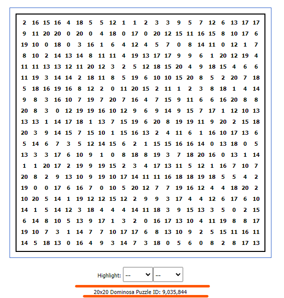

# Dominosa Solver script

This application is a solver to the [dominosa](https://www.puzzle-dominosa.com/) puzzle.

## How to use

On the website, each game has a board size and a unique id:


On the command line, these informations can be input through the parameters:
* -s (size)
* -i (id)

For the example above, the command line would look like:
```
java -jar dominosa-solver.jar -s 20 -i 9035844
```

And the solution to the board is printed on the console int the format:

```
[domino] = [[point1] [point2]]
.
.
.
```

## Requirements

This project requires:
* JRE 17
* Google Chrome

## Project dependencies:

The dependencies of the project are:
* [Selenium Web Driver](https://github.com/SeleniumHQ/selenium/releases/download/selenium-4.15.0/selenium-java-4.15.0.zip)
* [Apache Commons Cli](https://dlcdn.apache.org/commons/cli/binaries/commons-cli-1.6.0-bin.tar.gz)
* [Jsoup](https://jsoup.org/packages/jsoup-1.16.2.jar)


## Next steps

The result could be printed in a sorted manner (by points).

The project could be turned into a maven project so the dependencies are better managed.